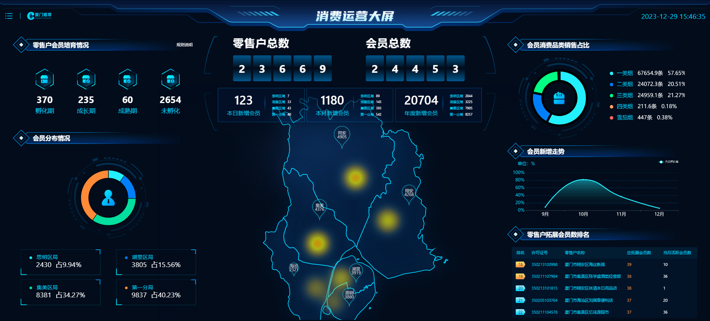
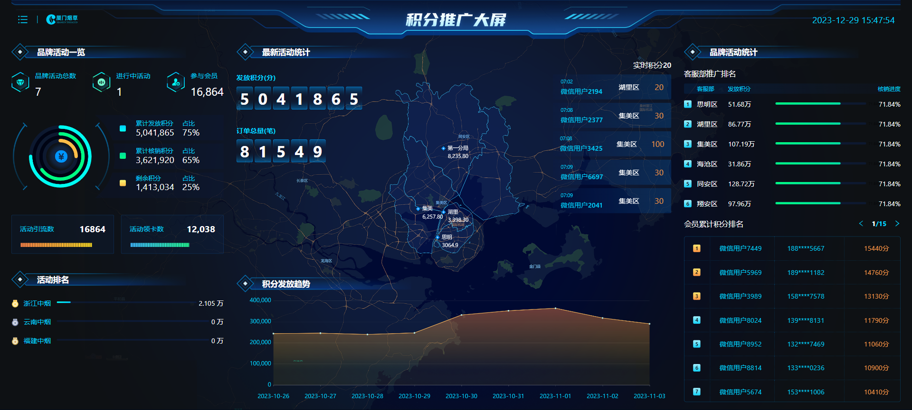
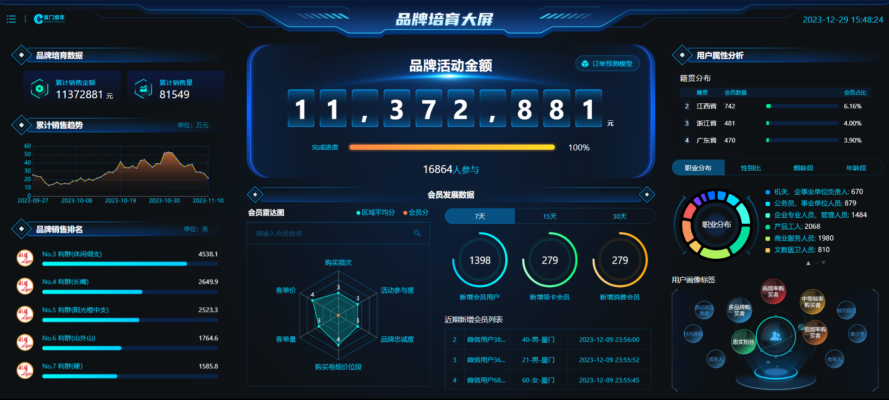
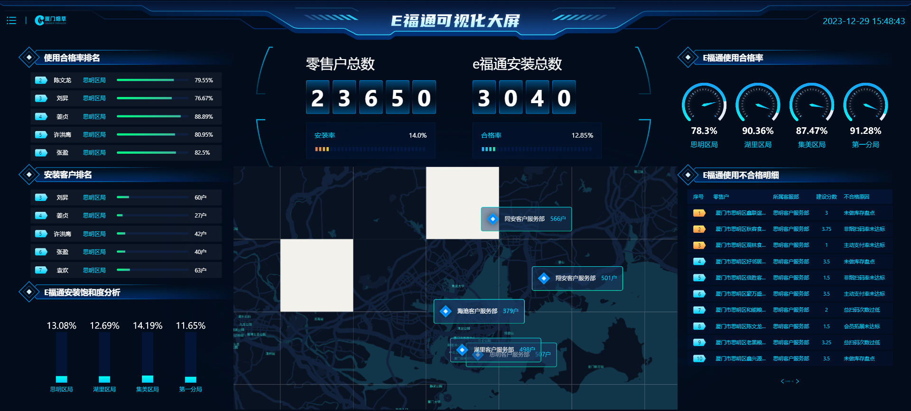

# Vue3数据可视化大屏项目

## 项目描述

本项目是一个Vue3数据可视化大屏项目，通过地图和图表的方式展现数据。

共有以下四个模块：

* 消费者运营大屏
* 积分推广大屏
* 品牌培育大屏
* 安装情况大屏

### 项目预览

**
    在线地址：** [https://www.anyaoqi.com/dataView/](https://www.anyaoqi.com/dataView/)

* 消费者运营大屏

  
* 积分推广大屏

  
* 品牌培育大屏

  
* 安装情况

  

## 环境要求

* Node: 16.0 或更高版本

## 技术栈

**主要技术**

* **前端框架：Vue3**
* **状态管理：Pinia**
* **打包工具：Vite**
* **CSS处理器：Sass**
* 图表：[ECharts](https://echarts.apache.org/)
* UI框架：[Ant-design-vue](https://antdv.com/components/overview-cn)

**其他技术**

* **代码检测：Eslint**
* **代码格式化：Prettier**
* **HTTP库：Axios**
* DataVVue3：[DataVVue3](https://datav-vue3.netlify.app/)
* 大屏适配：v-scale-screen

## vscode插件

* ESlint  代码格式和代码质量校验
* Prettier - Code formatter  代码格式化
* Prettier ESlint  解决ESlint和Prettier冲突问题

## 目录结构

* src
  * api   接口
  * assets 静态资源
  * components  组件
  * mock 数据模拟
  * router  路由
  * store  pinia状态管理
  * views 页面视图
  * App.vue 根组件
  * main.js   程序入口
* .eslintrc.cjs  ESlint规则配置
* .gitignore   git文件包含规则
* .prettierrc.json Prettier规则配置
* index.html
* vite.config.js 	vite配置

## 命令

* 启动项目

  ```
  npm run dev
  ```
* 打包编译

  ```
  npm run build
  ```
* 预览打包编译后的项目

  ```
  npm run preview
  ```
* 使用ESlint代码自动修复

  ```
  npm run lint
  ```
* 使用Prettier代码格式化

  ```
  npm run format
  ```
